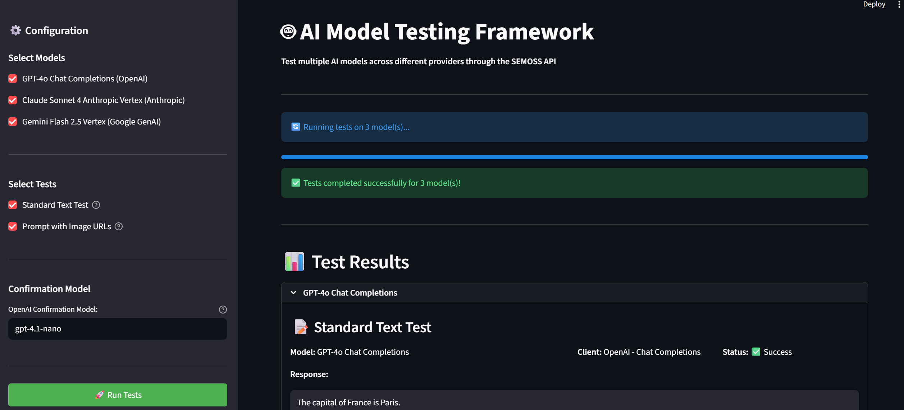

# Playground-Model-Testing

## Project Overview

This is a Python testing framework for validating AI model responses across different providers through the SEMOSS API. The framework runs standardized tests against multiple models and uses OpenAI models to confirm response quality.

## Docker Setup (Recommended)
1. Create an `.env` file based on the `.env.example` provided in the root directory.
2. Open Docker Desktop and run `docker-compose up --build` in the root directory of this project to start the server and frontend services. Make sure your SEMOSS instance is running.
- If you are developing and want to see code changes reflected you will need to rebuild the docker containers using `docker-compose up --build` after making changes.
3. The server will be available at `http://localhost:8888` and the frontend at `http://localhost:3000`.


## Local Environment Setup (You don't need this if using Docker)

**Required Environment Variables (in `.env`):**
- `SEMOSS_ACCESS_KEY` - Access key for SEMOSS API
- `SEMOSS_SECRET_KEY` - Secret key for SEMOSS API
- `SEMOSS_BASE_URL` - Base URL for SEMOSS instance (e.g., `http://localhost:9090/Monolith/api`)
- `OPENAI_API_KEY` - OpenAI API key for confirmation testing

### UV Server Installation
**Install Server dependencies in root directory:**
```bash
uv venv
```
**Then install required packages:**
```bash
uv sync
```
**If the above doesn't work, use:**
```bash
uv pip install -r pyproject.toml
```

### Pip Installation
**Alternatively, you can set up the environment using pip:**
**Install required packages using pip:**
1. Create and activate a virtual environment:
```bash
python -m venv venv
source venv/bin/activate  # On Windows use `venv\Scripts\activate`
```
2. Install dependencies:
```bash
pip install -r pyproject.toml
```

### Frontend Installation
**Install Frontend dependencies:**
```bash
cd client
```
```bash
npm install
```


## Running Application
**To run the server, use the following command:**
```bash
python server.py
```
- The server will start of port 8888
**To run the frontend, use the following command in the `client` directory:**
```bash
npm run dev
```
**Proceed to http://localhost:3000 in your web browser.**

## Project Structure
- `src/`: Contains all source code.
    - `runners/`: Logic for executing tests against selected models.
    - `tests/`: Standardized test cases and response models.
    - `utils/`: Utility functions and model definitions.
    - `confirmations/`: Logic for confirming test responses using OpenAI models.
    - `pixels/`: Pixel factory class for creating pixel calls

## Adding New Models
To add a new model, update the `models` list in `src/utils/models.py` with the new model's details.

## Adding New Tests
1. Create a new method in `src/tests/standard_tests.py` or create a new file/class with the method.
2. (If required) Update the Pixel Maker class to include any new parameters needed for the test.
3. Then update the `TestSelections` class in `src/runners/runners.py` to include the new test option.
4. Update the `run_selected_tests` function in `src/runners/runners.py` to execute the new test when selected.


## Features to Add


- [ ] **Ability to add models through UI**: Update the code to read models from a JSON file so that we can add models through the UI instead of hardcoding them in `models.py`

- [ ] **Full Capabilities Test**: Eventually when we have more tests built, I want the ability to add a model, run the full test suite and return a table of the capabilities of the model

